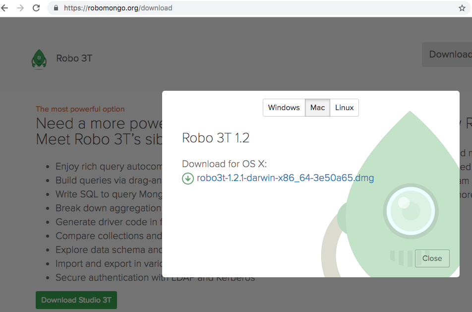
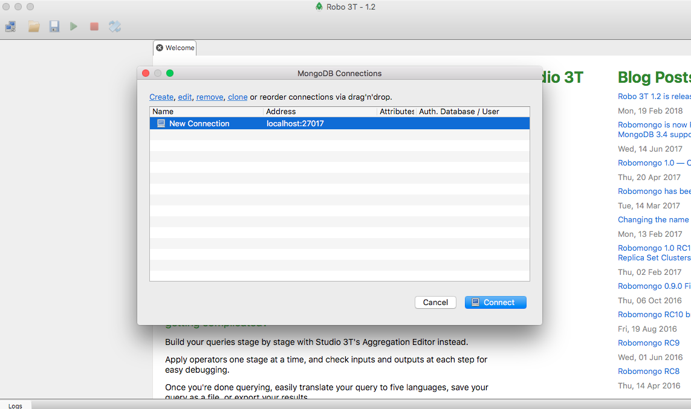
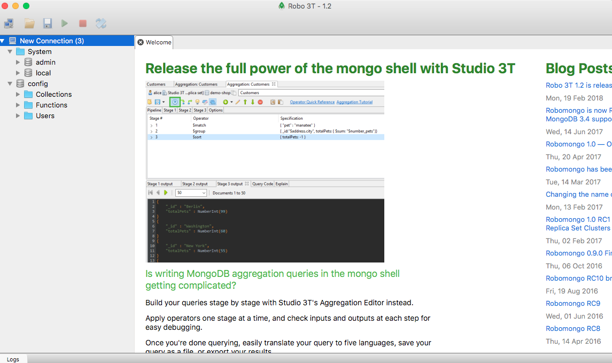

# Pendahuluan

## Install node.js
- Untuk install angular kita membutuhkan node.js dan NPM https://cli.angular.io/ 
- Install node.js terlebih dahulu https://nodejs.org/en/ 
- Sesuaikan dengan Sistem Operasi kalian windows, mac, linux
- Download dan Pilih yang Latest Feature
- Jika sudah terinstall maka buka cmd atau command promt ketik 
```
node – version
```
- Jika NPM sudah terinstall cek dengan command promt 
```
npm -v
```

## Install MongoDB
- install mongoDB https://www.mongodb.com/download-center/community **login terlebih dahulu**
- untuk cara install mongodb
    - https://docs.mongodb.com/manual/tutorial/install-mongodb-on-os-x/index.html
    - https://docs.mongodb.com/manual/tutorial/install-mongodb-on-windows/
- untuk mencoba mongodb
    - buka terminal ketik **mongod** **pastikan selalu on jika ingin menggunakan mongo**
    - buka terminal lagi ketik **mongo**
    - ketik perintah seperti **db** **show dbs**
- install Robo3T **native mongoDB management tools**  **cat:pastikan mongod tetap jalan** agar dapat langsung terkoneksi saat Robo3T dijalankan seperti pada gambar




## Install VsCode
- tambahkan beberapa extension agar memudahkan proses pembuatan code pada vscode
    - angular support,
    - angular files,
    - angular 7 snippsets 
    - angular language service

## Install Angular
- Untuk menginstall angular ketik code berikut pada command promt **(menggunakan angular versi 7.2.2)**
```
npm i -g @angular/cli@latest
```
- Untuk mengecek apakah angular sudah terinstall ketik kode berikut
```
ng --version
```
