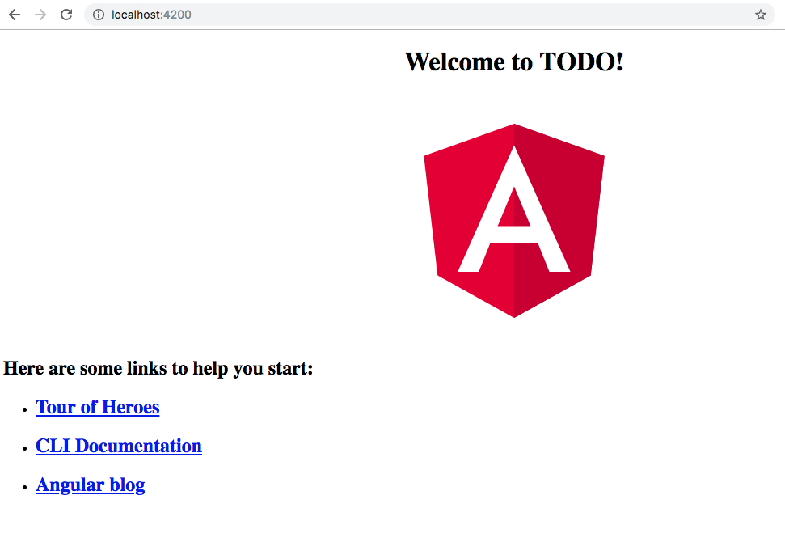

# Kemampuan Akhir Yang Direncanakan

- Peserta mampu menginstall angular
- Peserta mampu membuat project Todo Application


# Percobaan Membuat project ToDo 

- buat folder baru dengan nama **TODO** ketik code berikut

```
ng new TODO
```

- untuk menjalankan gunakan perintah 

```
ng serve
```
- jika berhasil maka hasilnya seperti pada gambar dibawah ini




## Install bootstrap
- langkah berikutnya **install bootstrap** dengan menggunakan perintah **cat:masuk dulu ke folder ToDO**

```
npm i bootstrap --save
```

- buka file **angular.json** di **ToDO/angular.json** tambahkan code berikut pada **style**

```
"styles": [
  "node_modules/bootstrap/dist/css/bootstrap.min.css",
  "styles.scss"
]
```

- jika berhasil maka akan seperti pada gambar berikut


## Install @ng-bootstrap
-  install @ng-bootstrap dengan cara **https://ng-bootstrap.github.io/#/home**

```
npm install --save @ng-bootstrap/ng-bootstrap
```

- buka file **app.module.ts** tambahkan **import {NgbModule} from '@ng-bootstrap/ng-bootstrap';** dan **NgbModule** sehingga keseluruhan code menjadi

```
import { BrowserModule } from '@angular/platform-browser';
import { NgModule } from '@angular/core';
import { NgbModule } from '@ng-bootstrap/ng-bootstrap';

import { AppComponent } from './app.component';

@NgModule({
  declarations: [
    AppComponent
  ],
  imports: [
    BrowserModule,
    NgbModule
  ],
  providers: [],
  bootstrap: [AppComponent]
})
export class AppModule { }


```