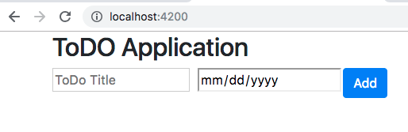
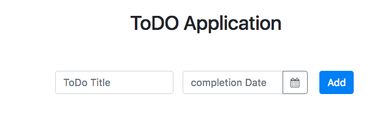

# Kemampuan Akhir Yang Direncanakan

- Peserta mampu membuat Form TODO
- peserta mampu membuat datepicker https://ng-bootstrap.github.io/#/components/datepicker/overview

# Percobaan membuat Form

- buka file **app.component.html** tambahkan code berikut

```
<div class="container">
  <div class="row"><h2 class="title">ToDO Application</h2></div>

  <div class="row">
    <form class="form-inline">
      <div class="form-row">
        <div class="col-md-5">
          <input type="text" name="" value="" placeholder="ToDo Title" />
        </div>
        <div class="col-md-5"><input type="date" /></div>
        <div class="col-md-2"><button class="btn btn-primary">Add</button></div>
      </div>
    </form>
  </div>
</div>

```

- jika berhasil maka hasilnya seperti pada gambar berikut


## menambahkan datepicker

- https://ng-bootstrap.github.io/#/components/datepicker/overview
- copy code datepicker berikut  dan paste ke **app.component.html**

```
<div class="form-group">
    <div class="input-group">
      <input class="form-control" placeholder="yyyy-mm-dd"
             name="dp" [(ngModel)]="model" ngbDatepicker #d="ngbDatepicker">
      <div class="input-group-append">
        <button class="btn btn-outline-secondary calendar" (click)="d.toggle()" type="button"></button>
      </div>
    </div>
  </div>

```
- buka file **app.component.html** dan modifikasi menjadi seperti pada gambar berikut

```
<div class="container">
  <div class="row"><h2 class="title">ToDO Application</h2></div>

  <div class="row">
    <form class="form-inline">
      <div class="form-row">
        <div class="col-md-5">
          <input type="text" name="title" class="form-control" placeholder="ToDo Title" autocomplete="off"/>
        </div>
        <div class="col-md-5">
          <!-- <input type="date" /> -->
          <div class="form-group">
              <div class="input-group">
                <input class="form-control" placeholder="completion Date"
                       name="dp" ngbDatepicker #d="ngbDatepicker" autocomplete="off">
                <div class="input-group-append">
                  <button class="btn btn-outline-secondary calendar" (click)="d.toggle()" type="button">
                    <i class="fa fa-calendar" aria-hidden="true"></i>
                  </button>
                </div>
              </div>
            </div>
        </div>
        <div class="col-md-2"><button class="btn btn-primary">Add</button></div>
      </div>
    </form>
  </div>
</div>


```

- buka file **app.component.css** tambahkan code berikut 

```
body {
    font-size: 15px;
    color: #343d44;
    font-family: 'segoe-ui', 'open-sans', tahoma, arial;
    padding: 0;
    margin: 0;
  }
  
  .container {
    margin: 0 auto;
    text-align: center;
  }
  
  .row {
    margin: 0 auto;
    text-align: center;
    padding: 30px;
  }
  
  .title {
    margin: 0 auto;
    text-align: center;
  }
  
  .form-inline {
    margin: 0 auto;
    text-align: center;
  }
  
  table {
    border-collapse: separate;
    border-spacing: 0 5px;
  }
  
  thead th {
    background-color: #007bff;
    color: white;
  }
  
  tbody td {
    background-color: #eeeeee;
  }
  
  tr td:first-child,
  tr th:first-child {
    border-top-left-radius: 6px;
    border-bottom-left-radius: 6px;
  }
  
  tr td:last-child,
  tr th:last-child {
    border-top-right-radius: 6px;
    border-bottom-right-radius: 6px;
  }
  
  .btn {
    cursor: pointer;
  }
  
  td {
    white-space: nowrap;
    overflow: hidden;
  }
  
  .icons button {
    margin: 0px 5px 0px 5px;
  }
  
  .fa-circle-o,
  .fa-check-circle {
    color: #007bff;
  }
  
  .empty {
    border: 1px solid red;
  }
  ```
- https://www.npmjs.com/package/angular-font-awesome install angular-font-awesome untuk menampillakn fa fa-calender

- ketik perintah berikut:

```
npm install --save font-awesome angular-font-awesome
```

- buka file **app.module.ts** tambahkan code berikut

```
//...
import { AngularFontAwesomeModule } from 'angular-font-awesome';
@NgModule({
  //...
  imports: [
    //...
    AngularFontAwesomeModule
  ],
  //...
})
export class AppModule { }

```

- buka file **angular.json** tambahkan code berikut

```
 "styles": [
              "node_modules/bootstrap/dist/css/bootstrap.min.css",
              "node_modules/font-awesome/css/font-awesome.css",
              "src/styles.css"
            ],

```
- jika berhasil maka tampilannya akan seperti pada gambar dibawah ini
