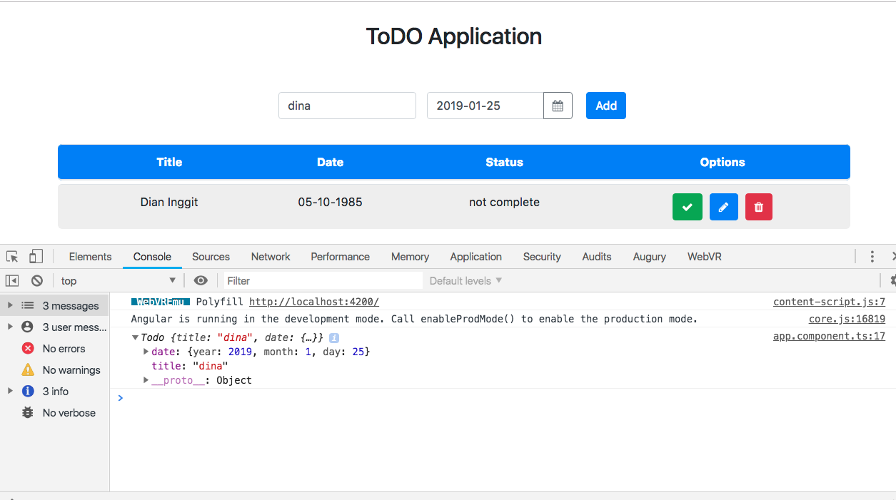
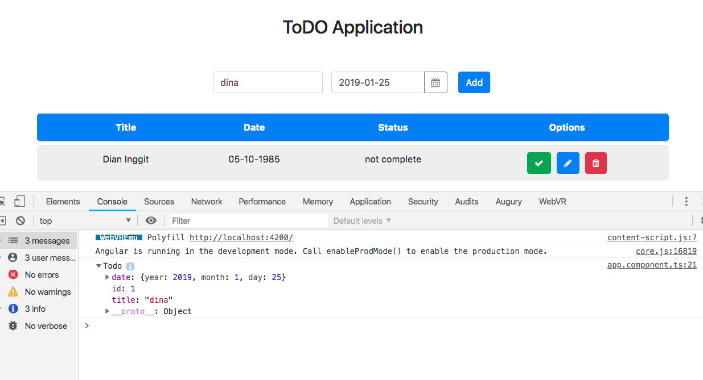
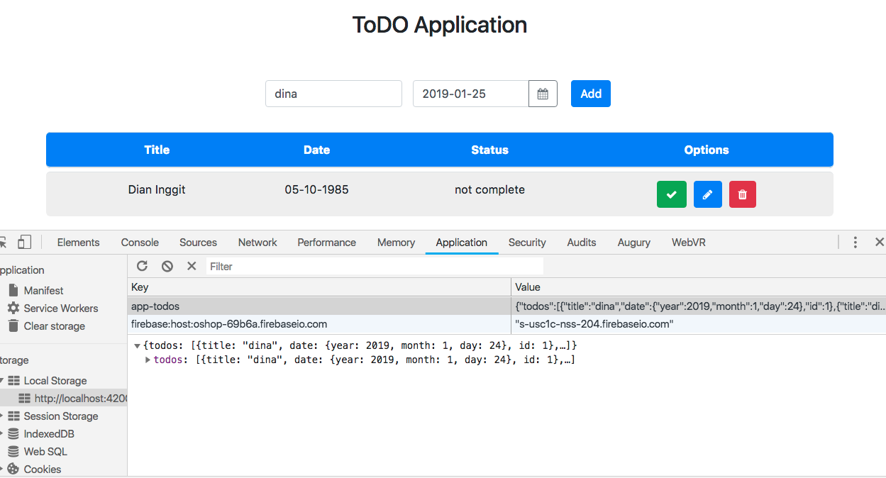

# Kemampuan Akhir Yang Direncanakan

- Peserta mampu membuat method addTodo

# Percobaan membuat method addTodo

- pada percobaan sebelumnya pada file **app.component.ts** terdapat method **appTodo**
- method **appTodo** ini digunakan sebagai trigger saat button add pada aplikasi ditekan. sebagai contoh lakukan percobaan berikut
- tambahkan console.log pada method appTdo

```
 
  addTodo(){
    console.log(this.newTodo);
  }
```
- jika benar saat kita klik add maka akan tampil seperti berikut



- langkah berikutnya tambahkan beberapa code pada file **app.component.ts** 

```
addTodo(){
    // console.log(this.newTodo);
    if(this.newTodo.title && this.newTodo.date){
      this.todoService.addTodos(this.newTodo);
      //cek isi new todo apakah berhasil
      console.log(this.newTodo);
    }
  }
```
- jika berhasil maka akan seperti gambar berikut



- buka pada application disitu data untuk sementara tersimpan di localStorage



- tambahkan beberapa code agar pada saat setelah di klik add, inputan menjadi kosong kembali **cat:di app.component.ts**

```
 addTodo(){
    // console.log(this.newTodo);
    if(this.newTodo.title && this.newTodo.date){
      this.todoService.addTodos(this.newTodo);
      //cek isi new todo apakah berhasil
      // console.log(this.newTodo);
      this.newTodo.title='';
      this.newTodo.date='';
```
