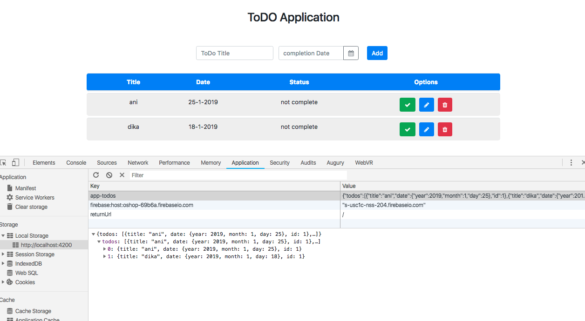

# Kemampuan Akhir Yang Direncanakan

- Peserta mampu menampilkan isi dari inputan TODO yang tersimpan di localstorage

# Percobaan View

- buka file **app.component.ts** tambahkan method get

```
 get todos(){
    return this.todoService.getAllTodos();
  }
```

- sehingga keseluruhan code pada **app.component.ts** seperti berikut

```
import { Component } from '@angular/core';
import { Todo } from './class/todo';
import { TodoDataService } from './services/todo-data.service';

@Component({
  selector: 'app-root',
  templateUrl: './app.component.html',
  styleUrls: ['./app.component.css']
})
export class AppComponent {

  newTodo:Todo=new Todo();

  constructor( private todoService:TodoDataService){}

  get todos(){
    return this.todoService.getAllTodos();
  }

  addTodo(){
    // console.log(this.newTodo);
    if(this.newTodo.title && this.newTodo.date){
      this.todoService.addTodos(this.newTodo);
      //cek isi new todo apakah berhasil
      // console.log(this.newTodo);
      this.newTodo.title='';
      this.newTodo.date='';
    }
  }
}
```

- buka file **app.component.html** tambahkan ngif dan ngfor pada **table** 

```
  <table class="table" *ngIf="todos.length>0">
    <thead>
      <tr>
        <th></th>
        <th>Title</th>
        <th>Date</th>
        <th>Status</th>
        <th>Options</th>
      </tr>
    </thead>
    <tbody>
      <tr *ngFor="let todo of todos">
        <td></td>
        <td>{{todo.title}}</td>
        <td>{{todo.date.day}}-{{todo.date.month}}-{{todo.date.year}}</td>
        <td *ngIf="!todo.complete"> not complete</td>
        <td *ngIf="todo.complete"> complete</td>
        <td class="icons">
          <button class="btn btn-success"><i class="fa fa-check"></i></button>
          <button class="btn btn-primary"><i class="fa fa-pencil"></i></button>
          <button class="btn btn-danger"><i class="fa fa-trash"></i></button>
        </td>
      </tr>
    </tbody>
  </table>
```

- jika benar maka akan seperti pada gambar dibawah ini **akan menampilkan isi array pada localstorage**

