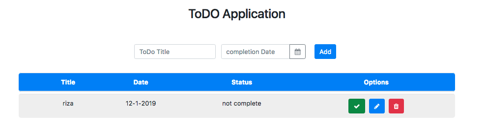
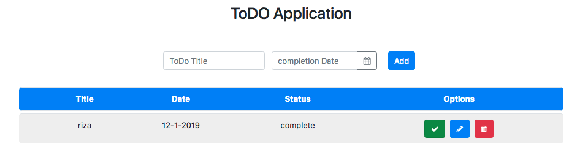
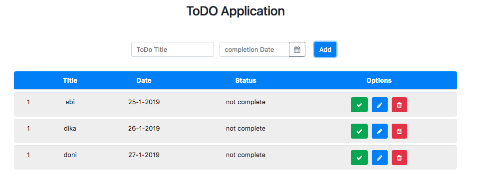
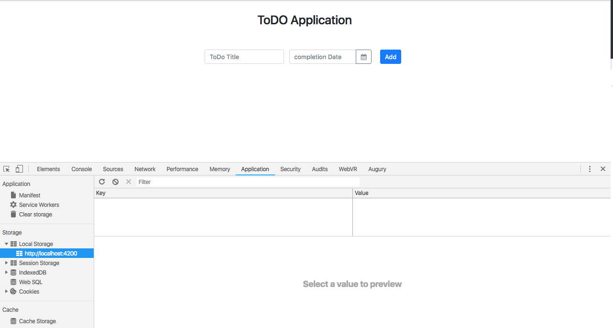
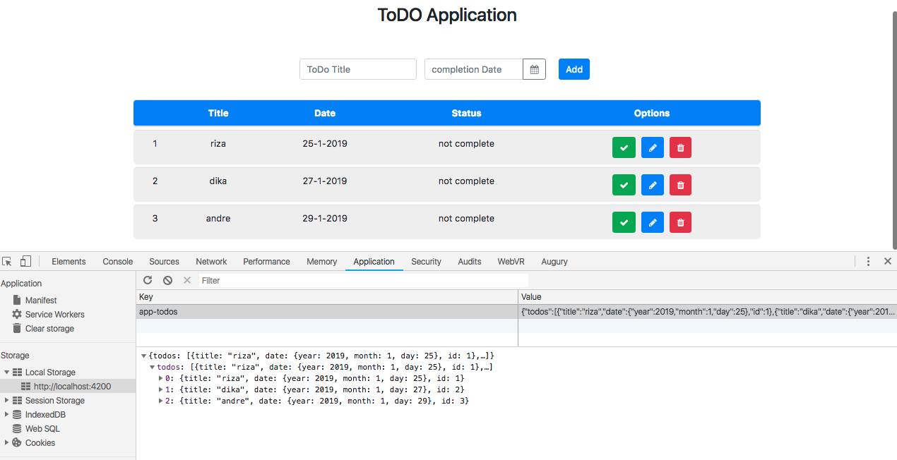
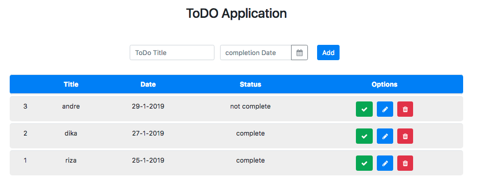
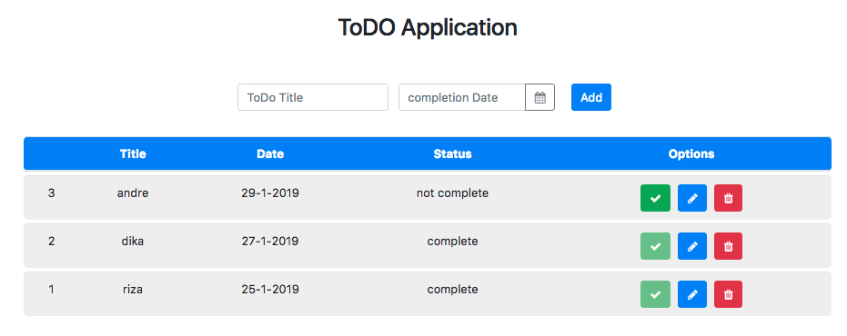
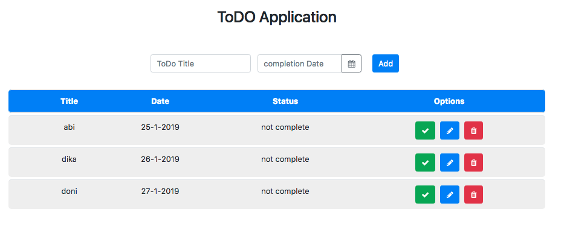

# Kemampuan Akhir Yang Direncanakan

- Peserta mampu membuat method toggle

# Percobaan membuat method CompleteTodo

- buka file **todo-data.service.ts** tambahkan method CompleteTodo

```
 compoleteTodo(todo:Todo){
    const updateTodo= this.updateTodo(todo.id,{
      complete:!todo.complete
    });
    return updateTodo;
  }

```
- buka file **app.component.html** tambahkan function click dan method completeTodo dengan parameter todo

```
<button class="btn btn-success"(click)="completeTodo(todo)"><i class="fa fa-check"></i></button>
```

- buka file **app.components.ts** tambahkan method **completeTodo**

```
  completeTodo(todo){
    this.todoService.compoleteTodo(todo);
  }

```

- untuk keseluruhan code nya pada file **app.components.ts** sebagai berikut

```
import { Component } from '@angular/core';
import { Todo } from './class/todo';
import { TodoDataService } from './services/todo-data.service';

@Component({
  selector: 'app-root',
  templateUrl: './app.component.html',
  styleUrls: ['./app.component.css']
})
export class AppComponent {

  newTodo:Todo=new Todo();

  constructor( private todoService:TodoDataService){}

  get todos(){
    return this.todoService.getAllTodos();
  }

  addTodo(){
    // console.log(this.newTodo);
    if(this.newTodo.title && this.newTodo.date){
      this.todoService.addTodos(this.newTodo);
      //cek isi new todo apakah berhasil
      // console.log(this.newTodo);
      this.newTodo.title='';
      this.newTodo.date='';
    }
  }

  completeTodo(todo){
    this.todoService.compoleteTodo(todo);
  }
}
```
- jika berhasil maka saat button success di klik maka status akan berubah seperti gambar berikut



- langkah berikutnya buka file **app.component.html** tambahkan  **todo.id**

```
 <tr *ngFor="let todo of todos">
        <td>{{todo.id}}</td>
        <td>{{todo.title}}</td>
        <td>{{todo.date.day}}-{{todo.date.month}}-{{todo.date.year}}</td>
```

- buka file **todo-data.service.ts** tambahkan code berikut di constuctor

```
constructor() {
    const todos=this.getAllTodos();
    if (todos.length===0){
      this.lastid=0;
    }else {
      const maxId= todos[todos.length-1].id;
      this.lastid = maxId+1;
    }
  }

```
- jadi keseluruhan code pada **todo-data.service.ts** sebagai berikut :

```
import { Injectable } from "@angular/core";
import { Todo } from "../class/todo";

@Injectable({
  providedIn: "root"
})
export class TodoDataService {
  lastid = 0;
  todos: Todo[] = [];

  constructor() {
    const todos=this.getAllTodos();
    if (todos.length===0){
      this.lastid=0;
    }else {
      const maxId= todos[todos.length-1].id;
      this.lastid = maxId+1;
    }
  }

  addTodos(todo: Todo): TodoDataService {
    if (!todo.id) {
      todo.id = ++this.lastid;
    }
    const todos = this.getAllTodos();
    todos.push(todo);
    //add code
    this.setTodo(todos);
    return this;
  }

  getAllTodos() {
    const storageItem = JSON.parse(window.localStorage.getItem("app-todos"));
    if (storageItem === null) {
      return [];
    } else {
      return storageItem.todos;
    }
  }

  getTodoById(id:number):Todo{
    const todos=this.getAllTodos();
    return todos.filter(todo=>todo.id===id).pop();
  }

  updateTodo(id:number,values:Object={}){
    const todo=this.getTodoById(id);
    if(!todo){
      return null;
    }
    let todos = this.getAllTodos();
    todos = todos.filter(t=>t.id !== todo.id);
    const todoValues= Object.assign(todo,values);
    todos.push(todoValues);
    this.setTodo(todos);
  }

  compoleteTodo(todo:Todo){
    const updateTodo= this.updateTodo(todo.id,{
      complete:!todo.complete
    });
    return updateTodo;
  }

  setTodo(usertodos: Todo[]) {
    window.localStorage.setItem(
      "app-todos",
      JSON.stringify({ todos: usertodos })
    );
  }
}
```

- jalan aplikasi dan amati id nya **jika kita lihat pada saat nambah idnya tetap**


- buka file **app.component.ts** tambahkan code **this.newTodo=new Todo()** pada method **addTodo()**

```
addTodo(){
    // console.log(this.newTodo);
    if(this.newTodo.title && this.newTodo.date){
      this.todoService.addTodos(this.newTodo);
      //cek isi new todo apakah berhasil
      // console.log(this.newTodo);
      this.newTodo= new Todo();
      this.newTodo.title='';
      this.newTodo.date='';
    }
  }
```
- clear **local storage** pada tab application 


- tambahkan beberapa data, jika benar maka id akan bertambah dan hasilnya seperti pada gambar berikut


- jika kita klik button succes maka status akan berubah seperti sebelumnya seperti pada gambar berikut


- buat kondisi dimana jika status sudah complete maka button akan disable
- buka file **app.component.html** tambahkan **[disabled]** 

```
 <button class="btn btn-success"(click)="completeTodo(todo)" [disabled]="todo.complete"><i class="fa fa-check"></i></button>

```

- jika benar maka data yang berstatus complete akan disabled button successnya seperti pada gambar berikut


- jika id berhasil bertambah maka hapus {{todo.id}} pada file **app.component.html** dan hasilnya akan seperti gambar berikut
