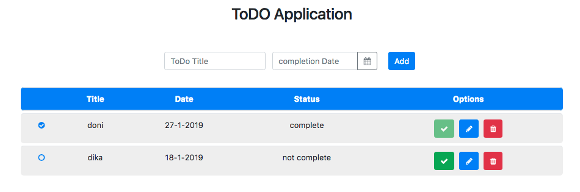

# Kemampuan Akhir Yang Direncanakan

- Peserta mampu menambahkan check icon

# Percobaan membuat check icon
- buka file **app.component.html** tambahkan code pengkondisian status complete

```
<tr *ngFor="let todo of todos">
        <td>
          <i class="fa fa-check-circle" aria-hidden="true" *ngIf="todo.complete"></i>
          <i class="fa fa-circle-o" aria-hidden="true" *ngIf="!todo.complete"></i>
        </td>

```

- sehingga code secara keseluruhan pada **app.component.html** seperti berikut

```
<div class="container">
  <div class="row"><h2 class="title">ToDO Application</h2></div>

  <div class="row">
    <form class="form-inline">
      <div class="form-row">
        <div class="col-md-5">
          <input
            type="text"
            name="title"
            [(ngModel)]="newTodo.title"
            class="form-control"
            placeholder="ToDo Title"
            autocomplete="off"
          />
        </div>
        <div class="col-md-5">
          <!-- <input type="date" /> -->
          <div class="form-group">
            <div class="input-group">
              <input
                class="form-control"
                placeholder="completion Date"
                name="dp"
                [(ngModel)]="newTodo.date"
                ngbDatepicker
                #d="ngbDatepicker"
                autocomplete="off"
              />
              <div class="input-group-append">
                <button
                  class="btn btn-outline-secondary calendar"
                  (click)="d.toggle()"
                  type="button"
                >
                  <i class="fa fa-calendar" aria-hidden="true"></i>
                </button>
              </div>
            </div>
          </div>
        </div>
        <div class="col-md-2">
          <button class="btn btn-primary" (click)="addTodo()">Add</button>
        </div>
      </div>
    </form>
  </div>

  <table class="table" *ngIf="todos.length > 0">
    <thead>
      <tr>
        <th></th>
        <th>Title</th>
        <th>Date</th>
        <th>Status</th>
        <th>Options</th>
      </tr>
    </thead>
    <tbody>
      <tr *ngFor="let todo of todos">
        <td>
          <i class="fa fa-check-circle" aria-hidden="true" *ngIf="todo.complete"></i>
          <i class="fa fa-circle-o" aria-hidden="true" *ngIf="!todo.complete"></i>
        </td>
        <td>{{ todo.title }}</td>
        <td>{{ todo.date.day }}-{{ todo.date.month }}-{{ todo.date.year }}</td>
        <td *ngIf="!todo.complete">not complete</td>
        <td *ngIf="todo.complete">complete</td>
        <td class="icons">
          <button
            class="btn btn-success"
            (click)="completeTodo(todo)"
            [disabled]="todo.complete"
          >
            <i class="fa fa-check"></i>
          </button>
          <button class="btn btn-primary"><i class="fa fa-pencil"></i></button>
          <button class="btn btn-danger"><i class="fa fa-trash"></i></button>
        </td>
      </tr>
    </tbody>
  </table>
</div>
```

- jika benar maka yang berstatus complete maka akan tampil check circle sedangkan jika yang berstatus tidak complete maka akan muncul circle saja seperti pada gamabar berikut

