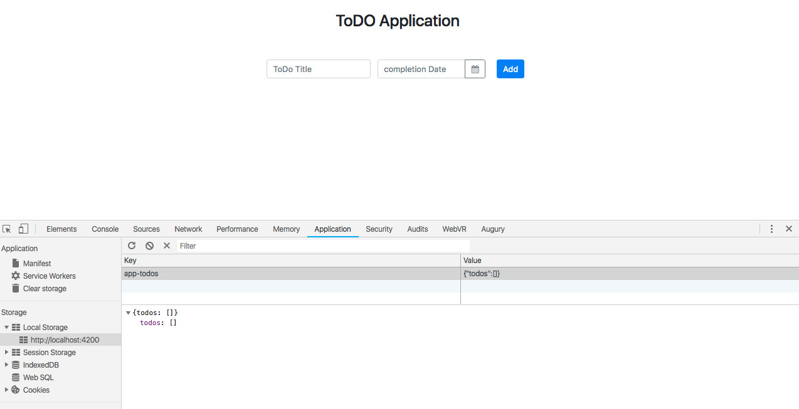

# Kemampuan Akhir Yang Direncanakan

- Peserta mampu membuat delete method di service Todo

# Percobaan membuat method delete

- buka file **todo-data.service.ts** buatlah method dengan nama delete

```

deleteTodoById(id:number){
    let todos = this.getAllTodos();
    todos = todos.filter(todo => todo.id!==id);
    this.setTodo(todos);
  }

```
- sehingga code keseluruhan pada **todo-data.service.ts**

```
import { Injectable } from "@angular/core";
import { Todo } from "../class/todo";

@Injectable({
  providedIn: "root"
})
export class TodoDataService {
  lastid = 0;
  todos: Todo[] = [];

  constructor() {
    const todos=this.getAllTodos();
    if (todos.length===0){
      this.lastid=0;
    }else {
      const maxId= todos[todos.length-1].id;
      this.lastid = maxId+1;
    }
  }

  addTodos(todo: Todo): TodoDataService {
    if (!todo.id) {
      todo.id = ++this.lastid;
    }
    const todos = this.getAllTodos();
    todos.push(todo);
    //add code
    this.setTodo(todos);
    return this;
  }

  getAllTodos() {
    const storageItem = JSON.parse(window.localStorage.getItem("app-todos"));
    if (storageItem === null) {
      return [];
    } else {
      return storageItem.todos;
    }
  }

  getTodoById(id:number):Todo{
    const todos=this.getAllTodos();
    return todos.filter(todo=>todo.id===id).pop();
  }

  updateTodo(id:number,values:Object={}){
    const todo=this.getTodoById(id);
    if(!todo){
      return null;
    }
    let todos = this.getAllTodos();
    todos = todos.filter(t=>t.id !== todo.id);
    const todoValues= Object.assign(todo,values);
    todos.push(todoValues);
    this.setTodo(todos);
  }

  compoleteTodo(todo:Todo){
    const updateTodo= this.updateTodo(todo.id,{
      complete:!todo.complete
    });
    return updateTodo;
  }

  deleteTodoById(id:number){
    let todos = this.getAllTodos();
    todos = todos.filter(todo => todo.id!==id);
    this.setTodo(todos);
  }

  setTodo(usertodos: Todo[]) {
    window.localStorage.setItem(
      "app-todos",
      JSON.stringify({ todos: usertodos })
    );
  }
}

```
- buka file **app.component.html** dan tambahkan function click 

```
    <button class="btn btn-danger"><i class="fa fa-trash" (click)="deleteTod(todo)"></i></button>
```
- buka file **app.component.ts** tambahkan method deleteTodoById 

```
deleteTod(todo){
    this.todoService.deleteTodoById(todo.id);
  }
```
- sehingga code keseluruhan pada **app.component.ts** sebagai berikut:

```
import { Component } from '@angular/core';
import { Todo } from './class/todo';
import { TodoDataService } from './services/todo-data.service';

@Component({
  selector: 'app-root',
  templateUrl: './app.component.html',
  styleUrls: ['./app.component.css']
})
export class AppComponent {

  newTodo:Todo=new Todo();

  constructor( private todoService:TodoDataService){}

  get todos(){
    return this.todoService.getAllTodos();
  }

  addTodo(){
    // console.log(this.newTodo);
    if(this.newTodo.title && this.newTodo.date){
      this.todoService.addTodos(this.newTodo);
      //cek isi new todo apakah berhasil
      // console.log(this.newTodo);
      this.newTodo= new Todo();
      this.newTodo.title='';
      this.newTodo.date='';
    }
  }

  deleteTod(todo){
    this.todoService.deleteTodoById(todo.id);
  }

  completeTodo(todo){
    this.todoService.compoleteTodo(todo);
  }
}

```
- jika berhasil maka data akan berhasil dihapus

