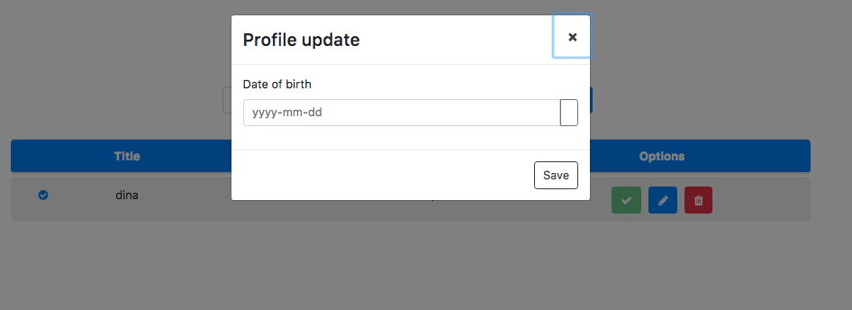
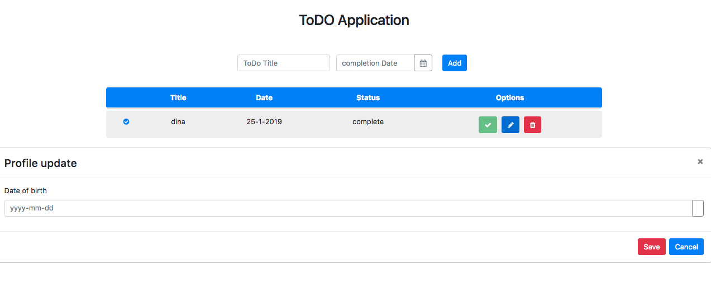
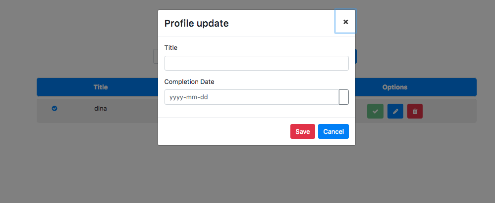

# Kemampuan Akhir Yang Direncanakan

- Peserta mampu menggunakan modal untuk update
- https://ng-bootstrap.github.io/#/components/modal/examples

# Percobaan membuat modal
- copy code berikut dan pastekan ke file **app.component.html**

```
<ng-template #content let-modal>
  <div class="modal-header">
    <h4 class="modal-title" id="modal-basic-title">Profile update</h4>
    <button type="button" class="close" aria-label="Close" (click)="modal.dismiss('Cross click')">
      <span aria-hidden="true">&times;</span>
    </button>
  </div>
  <div class="modal-body">
    <form>
      <div class="form-group">
        <label for="dateOfBirth">Date of birth</label>
        <div class="input-group">
          <input id="dateOfBirth" class="form-control" placeholder="yyyy-mm-dd" name="dp" ngbDatepicker #dp="ngbDatepicker">
          <div class="input-group-append">
            <button class="btn btn-outline-secondary calendar" (click)="dp.toggle()" type="button"></button>
          </div>
        </div>
      </div>
    </form>
  </div>
  <div class="modal-footer">
    <button type="button" class="btn btn-outline-dark" (click)="modal.close('Save click')">Save</button>
  </div>
</ng-template>

```

- sehingga hasil code pada file **app.component.html** sebagai berikut

```
<div class="container">
  <div class="row"><h2 class="title">ToDO Application</h2></div>

  <div class="row">
    <form class="form-inline">
      <div class="form-row">
        <div class="col-md-5">
          <input
            type="text"
            name="title"
            [(ngModel)]="newTodo.title"
            class="form-control"
            placeholder="ToDo Title"
            autocomplete="off"
          />
        </div>
        <div class="col-md-5">
          <!-- <input type="date" /> -->
          <div class="form-group">
            <div class="input-group">
              <input
                class="form-control"
                placeholder="completion Date"
                name="dp"
                [(ngModel)]="newTodo.date"
                ngbDatepicker
                #d="ngbDatepicker"
                autocomplete="off"
              />
              <div class="input-group-append">
                <button
                  class="btn btn-outline-secondary calendar"
                  (click)="d.toggle()"
                  type="button"
                >
                  <i class="fa fa-calendar" aria-hidden="true"></i>
                </button>
              </div>
            </div>
          </div>
        </div>
        <div class="col-md-2">
          <button class="btn btn-primary" (click)="addTodo()">Add</button>
        </div>
      </div>
    </form>
  </div>

  <table class="table" *ngIf="todos.length > 0">
    <thead>
      <tr>
        <th></th>
        <th>Title</th>
        <th>Date</th>
        <th>Status</th>
        <th>Options</th>
      </tr>
    </thead>
    <tbody>
      <tr *ngFor="let todo of todos">
        <td>
          <i
            class="fa fa-check-circle"
            aria-hidden="true"
            *ngIf="todo.complete"
          ></i>
          <i
            class="fa fa-circle-o"
            aria-hidden="true"
            *ngIf="!todo.complete"
          ></i>
        </td>
        <td>{{ todo.title }}</td>
        <td>{{ todo.date.day }}-{{ todo.date.month }}-{{ todo.date.year }}</td>
        <td *ngIf="!todo.complete">not complete</td>
        <td *ngIf="todo.complete">complete</td>
        <td class="icons">
          <button
            class="btn btn-success"
            (click)="completeTodo(todo)"
            [disabled]="todo.complete"
          >
            <i class="fa fa-check"></i>
          </button>
          <button class="btn btn-primary"><i class="fa fa-pencil"></i></button>
          <button class="btn btn-danger">
            <i class="fa fa-trash" (click)="deleteTod(todo)"></i>
          </button>
        </td>
      </tr>
    </tbody>
  </table>
</div>

<ng-template #content let-modal>
  <div class="modal-header">
    <h4 class="modal-title" id="modal-basic-title">Profile update</h4>
    <button
      type="button"
      class="close"
      aria-label="Close"
      (click)="modal.dismiss('Cross click')"
    >
      <span aria-hidden="true">&times;</span>
    </button>
  </div>
  <div class="modal-body">
    <form>
      <div class="form-group">
        <label for="dateOfBirth">Date of birth</label>
        <div class="input-group">
          <input
            id="dateOfBirth"
            class="form-control"
            placeholder="yyyy-mm-dd"
            name="dp"
            ngbDatepicker
            #dp="ngbDatepicker"
          />
          <div class="input-group-append">
            <button
              class="btn btn-outline-secondary calendar"
              (click)="dp.toggle()"
              type="button"
            ></button>
          </div>
        </div>
      </div>
    </form>
  </div>
  <div class="modal-footer">
    <button
      type="button"
      class="btn btn-outline-dark"
      (click)="modal.close('Save click')"
    >
      Save
    </button>
  </div>
</ng-template>
```

- tambahkan method **(click)="open(content,todo)** pada file **app.component.html**

```
  <button class="btn btn-primary" (click)="open(content,todo)"><i class="fa fa-pencil"></i></button>
```

- buka file **app.component.ts** tambahkan method **open(content,todo)** , tambahkan juga code **private modalService: NgbModal** pada **construktor**

```
import { Component } from '@angular/core';
import { Todo } from './class/todo';
import { TodoDataService } from './services/todo-data.service';
import { NgbModal } from '@ng-bootstrap/ng-bootstrap';

@Component({
  selector: 'app-root',
  templateUrl: './app.component.html',
  styleUrls: ['./app.component.css']
})
export class AppComponent {

  newTodo:Todo=new Todo();

  constructor( private todoService:TodoDataService,private modalService: NgbModal){}

  get todos(){
    return this.todoService.getAllTodos();
  }

  addTodo(){
    // console.log(this.newTodo);
    if(this.newTodo.title && this.newTodo.date){
      this.todoService.addTodos(this.newTodo);
      //cek isi new todo apakah berhasil
      // console.log(this.newTodo);
      this.newTodo= new Todo();
      this.newTodo.title='';
      this.newTodo.date='';
    }
  }

  deleteTod(todo){
    this.todoService.deleteTodoById(todo.id);
  }

  completeTodo(todo){
    this.todoService.compoleteTodo(todo);
  }

  open(content,todo){
    this.modalService.open(content, {ariaLabelledBy: 'modal-basic-title'});
  }
}

```
- sehingga hasilnya seperti gambar dibawah ini


- jika kita lihat pada gambar diatas hanya ada form input tanggal sedangkan yang title belum ada, untuk itu lakukan langkah-langkah berikut

- buka file **app.module.ts** dan tambahkan **ReactiveFormModule**

```
import { BrowserModule } from '@angular/platform-browser';
import { NgModule } from '@angular/core';
import { NgbModule } from '@ng-bootstrap/ng-bootstrap';
import { AngularFontAwesomeModule } from 'angular-font-awesome';
import { AppComponent } from './app.component';
import { FormsModule, ReactiveFormsModule } from '@angular/forms';
import { TodoDataService } from './services/todo-data.service';

@NgModule({
  declarations: [
    AppComponent
  ],
  imports: [
    BrowserModule,
    NgbModule,
    AngularFontAwesomeModule,
    FormsModule,
    ReactiveFormsModule
  ],
  providers: [TodoDataService],
  bootstrap: [AppComponent]
})
export class AppModule { }
```

- buka file **app.component.html** tambahkan code berikut **[ formGroup ]="editForm** pada **class=modal-body**

```
<div class="modal-body">
    <form [formGroup]="editForm">
      <div class="form-group">
        <label for="dateOfBirth">Date of birth</label>
        <div class="input-group">
```
- pada file **app.component.html** modifikasi pada **class="modal-footer**
```
  <div class="modal-footer">
    <button
      type="button"
      class="btn btn-danger"
      (click)="modal.close('Save click')"
    >
      Save
    </button>
    <button
    type="button"
    class="btn btn-primary"
    (click)="updateTodo()"
  >
    Cancel
  </button>
  </div>
```

- buka file **app.component.ts** tambahkan method **UpdateTodo()** dan tambahkan juga property baru dengan nama **editForm** sehingga keseluruhan codenya menjadi seperti berikut

```
import { Component } from '@angular/core';
import { Todo } from './class/todo';
import { TodoDataService } from './services/todo-data.service';
import { NgbModal } from '@ng-bootstrap/ng-bootstrap';
import { FormGroup } from '@angular/forms';

@Component({
  selector: 'app-root',
  templateUrl: './app.component.html',
  styleUrls: ['./app.component.css']
})
export class AppComponent {

  newTodo:Todo=new Todo();
  editForm:FormGroup;

  constructor( private todoService:TodoDataService,private modalService: NgbModal){}

  get todos(){
    return this.todoService.getAllTodos();
  }

  addTodo(){
    // console.log(this.newTodo);
    if(this.newTodo.title && this.newTodo.date){
      this.todoService.addTodos(this.newTodo);
      //cek isi new todo apakah berhasil
      // console.log(this.newTodo);
      this.newTodo= new Todo();
      this.newTodo.title='';
      this.newTodo.date='';
    }
  }

  deleteTod(todo){
    this.todoService.deleteTodoById(todo.id);
  }

  completeTodo(todo){
    this.todoService.compoleteTodo(todo);
  }

  open(content,todo){
    this.modalService.open(content, {ariaLabelledBy: 'modal-basic-title'});
  }

  updateTodo(){

  }
}


```

- jika dijalankan hasil sementara seperti pada gambar berikut:


- Jika lihat gambar diatas modal tak keluar pada semestinya. Untuk itu lakukan hal berikut

- buka file **app.component.html** tambahkan **formcontrol** pada  **inputan id=dateOfBirth** rubah semua **dateOfBirth** menjadi **date** seperti code berikut **(pada class=mmodal-body)**

```
  <div class="modal-body">
    <form [formGroup]="editForm">
      <div class="form-group">
        <label for="date">Completion Date</label>
        <div class="input-group">
          <input
            id="date"
            class="form-control"
            formControlName="date"
            placeholder="yyyy-mm-dd"
            name="dp"
            ngbDatepicker
            #dp="ngbDatepicker"
          />
          <div class="input-group-append">
            <button
              class="btn btn-outline-secondary calendar"
              (click)="dp.toggle()"
              type="button"
            ></button>
          </div>
        </div>
      </div>
    </form>
  </div>
```

- tambahkan **class=form-group**  pada **class=modal-body** sehingga hasil code seperti berikut

```
  <div class="modal-body">
    <form [formGroup]="editForm">
      <div class="form-group">
        <label for="">Title</label>
          <div class="input-group">
            <input type="text" class="form-control" formControlName="title">
          </div>
      </div>
      <div class="form-group">
        <label for="date">Completion Date</label>
        <div class="input-group">
          <input
            id="date"
            class="form-control"
            formControlName="date"
            placeholder="yyyy-mm-dd"
            name="dp"
            ngbDatepicker
            #dp="ngbDatepicker"
          />
          <div class="input-group-append">
            <button
              class="btn btn-outline-secondary calendar"
              (click)="dp.toggle()"
              type="button"
            ></button>
          </div>
        </div>
      </div>
    </form>
  </div>
```

- buka file **app.component.ts** tambahkan method **initForm**, tambahkan juga pada method **open** code berikut **this.initForm();** dan tambahkan pada  **constructor(private fb:FormBuilder)** sehingga keseluruhan codenya menjadi seperti berikut:

```
import { Component } from '@angular/core';
import { Todo } from './class/todo';
import { TodoDataService } from './services/todo-data.service';
import { NgbModal } from '@ng-bootstrap/ng-bootstrap';
import { FormGroup, FormBuilder, Validators } from '@angular/forms';
import { Content } from '@angular/compiler/src/render3/r3_ast';

@Component({
  selector: 'app-root',
  templateUrl: './app.component.html',
  styleUrls: ['./app.component.css']
})
export class AppComponent {

  newTodo:Todo=new Todo();
  editForm:FormGroup;

  constructor( 
    private todoService:TodoDataService,
    private modalService: NgbModal,
    private fb:FormBuilder){}

  get todos(){
    return this.todoService.getAllTodos();
  }

  addTodo(){
    // console.log(this.newTodo);
    if(this.newTodo.title && this.newTodo.date){
      this.todoService.addTodos(this.newTodo);
      //cek isi new todo apakah berhasil
      // console.log(this.newTodo);
      this.newTodo= new Todo();
      this.newTodo.title='';
      this.newTodo.date='';
    }
  }

  deleteTod(todo){
    this.todoService.deleteTodoById(todo.id);
  }

  completeTodo(todo){
    this.todoService.compoleteTodo(todo);
  }

  open(content,todo){
    this.initForm();
    this.modalService.open(content, {ariaLabelledBy: 'modal-basic-title'});
  }

  updateTodo(){

  }

  initForm(){
    this.editForm=this.fb.group({
      title:['',Validators.required],
      date:['',Validators.required]
    });

  }
}
```
- jika berhasil maka hasilnya seperti berikut:

