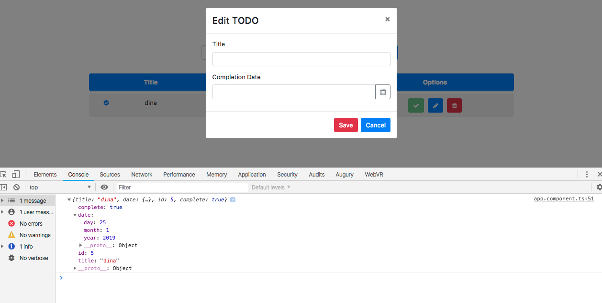
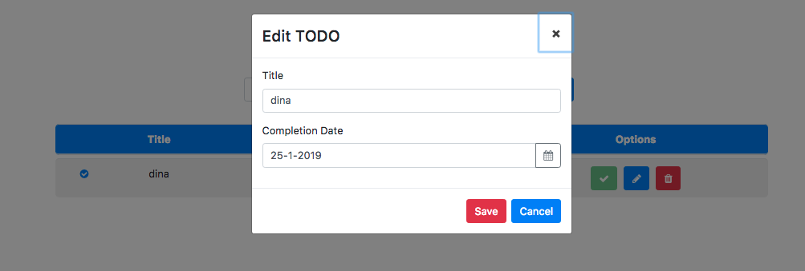
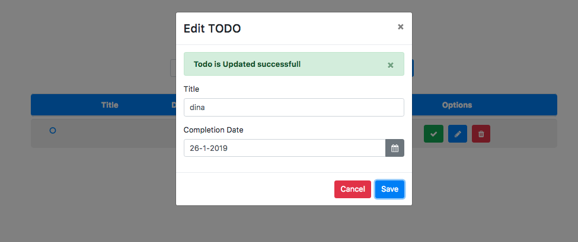

# Kemampuan Akhir Yang Direncanakan

- Peserta mampu membuat update method

# Percobaan menambahkan code pada update method

- langkah berikutnya buka file **app.component.html** hapus **placehoder="yyyy-mm-dd"** dan ganti label **profile update** menjadi **Edit Todo**, tambahkan juga code <i class="fa fa-calendar" aria-hidden="true"> sehingga codenya seperti berikut 

```
 <div class="form-group">
        <label for="date">Completion Date</label>
        <div class="input-group">
          <input
            id="date"
            class="form-control"
            formControlName="date"
            name="dp"
            ngbDatepicker
            #dp="ngbDatepicker"
          />
          <div class="input-group-append">
            <button
              class="btn btn-outline-secondary calendar"
              (click)="dp.toggle()"
              type="button"
            ><i class="fa fa-calendar" aria-hidden="true"></i></button>
          </div>
        </div>
      </div>
```


- buka file **app.component.ts** tambahkan property **todo,titlteValue,dateValue** seperti berikut 

```
export class AppComponent {

  newTodo:Todo=new Todo();
  editForm:FormGroup;
  todo:any;
  titleValue:string;
  dateValue:string;

  constructor( 
    private todoService:TodoDataService,
    private modalService: NgbModal,
    private fb:FormBuilder){}
```

- kita cek apakah pada method **open** isi dari parameter todo tambahkan code **console.log(todo)**

```
 open(content,todo){
    console.log(todo);
    this.initForm();
    this.modalService.open(content, {ariaLabelledBy: 'modal-basic-title'});
  }
```



- buka file **app.component.ts** dan tambahkan code berikut pada method **open**
- perhatikan pada code **this.titleValue dan this.dateValue itu bukan petik satu('') tapi Aksen akut(``)**

```
 open(content,todo){
   open(content,todo){
    // console.log(todo);
    this.initForm();
    this.todo={
      id: todo.id,
      title:todo.title,
      date:todo.date,
      complete:todo.complete
    }
    if(todo.date.year && todo.date.month){
      console.log(todo.date.year && todo.date.month);
      this.titleValue=`${todo.title}`;
      this.dateValue=`${todo.date.day}-${todo.date.month}-${todo.date.year}`;
    }
    this.modalService.open(content, {ariaLabelledBy: 'modal-basic-title'});
  }
```
- buka file **app.component.html** dan tambahkan **value** pada  **class modal-body** dan **form-group editForm dan form-group completion**

```
 <div class="modal-body">
    <form [formGroup]="editForm">
      <div class="form-group">
        <label for="">Title</label>
        <div class="input-group">
          <input
            type="text"
            class="form-control"
            formControlName="title"
            name="title"
            value="{{ titleValue }}"
          />
        </div>
      </div>
      <div class="form-group">
        <label for="date">Completion Date</label>
        <div class="input-group">
          <input
            id="date"
            class="form-control"
            formControlName="date"
            name="dp"
            value="{{ dateValue }}"
            ngbDatepicker
            #dp="ngbDatepicker"
          />
```
- jika benar maka hasilnya akan seperti berikut


- buka file **app.component.ts** tambahkan beberapa code pada **method updateTodo dan method open** tambahkan juga property **isEdited type boolean**

```
 newTodo:Todo=new Todo();
  editForm:FormGroup;
  todo:any;
  titleValue:string;
  dateValue:string;
  isEdited:boolean;
```

```
 updateTodo(){
    this.todoService.updateTodo(this.todo.id,this.editForm.value);
    this.isEdited=true;
  }
```
```
  open(content,todo){
    // console.log(todo);
    this.isEdited=false;
    this.initForm();
    this.todo={
      id: todo.id,
      title:todo.title,
      date:todo.date,
      complete:todo.complete
    }
    if(todo.date.year && todo.date.month){
      // console.log(todo.date.year && todo.date.month);
      this.titleValue=`${todo.title}` ;
      this.dateValue=`${todo.date.day}-${todo.date.month}-${todo.date.year}`;
    }
    this.modalService.open(content, {ariaLabelledBy: 'modal-basic-title'});
  }
```
- selanjutnya kita tambahkan alert, buka file **app.component.html**

```
<ngb-alert [dismissible]="false">
    <strong>Warning!</strong> Better check yourself, you're not looking too good.
  </ngb-alert>
```

```
  <div class="modal-body">
    <!-- alert -->
    <ngb-alert *ngIf="isEdited" type="success">
        <strong>Todo is Updated successfull</strong>
      </ngb-alert>

    <form [formGroup]="editForm">
      <div class="form-group">
        <label for="">Title</label>
        <div class="input-group">
```

- rubah code button **yang sebelumnya cancel menjadi save dan begitu sebalik** pada **app.component.html** seperti gambar berikut

```
    <button
      type="button"
      class="btn btn-danger"
      (click)="modal.close('Save click')"
    >
      Save
    </button>
    <button type="button" class="btn btn-primary" (click)="updateTodo()">
      Cancel
    </button>
```

- jika berhasil maka akan seperti berikut:
