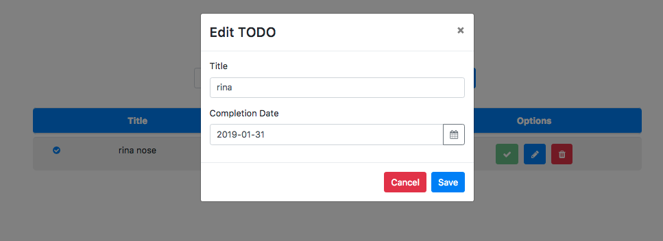

# Kemampuan Akhir Yang Direncanakan

- Peserta  mampu memperbaiki fungsi dari update

# Percobaan memperbaiki fungsi dari update

- jika kita lakukan proses save maka hasilnya akan seperti gambar berikut


- hal ini dikarenakan method update tidak berjalan dengan baik. Untuk itu lakukan beberapa step berikut ini
- buka fike **app.component.ts** modifikasi method initForm

```
import { Component } from '@angular/core';
import { Todo } from './class/todo';
import { TodoDataService } from './services/todo-data.service';
import { NgbModal } from '@ng-bootstrap/ng-bootstrap';
import { FormGroup, FormBuilder, Validators } from '@angular/forms';
import { Content } from '@angular/compiler/src/render3/r3_ast';

@Component({
  selector: 'app-root',
  templateUrl: './app.component.html',
  styleUrls: ['./app.component.css']
})
export class AppComponent {

  newTodo:Todo=new Todo();
  editForm:FormGroup;
  todo:any;
  titleValue:string;
  dateValue:string;
  isEdited:boolean;

  constructor( 
    private todoService:TodoDataService,
    private modalService: NgbModal,
    private fb:FormBuilder){}

  get todos(){
    return this.todoService.getAllTodos();
  }

  addTodo(){
    // console.log(this.newTodo);
    if(this.newTodo.title && this.newTodo.date){
      this.todoService.addTodos(this.newTodo);
      //cek isi new todo apakah berhasil
      // console.log(this.newTodo);
      this.newTodo= new Todo();
      this.newTodo.title='';
      this.newTodo.date='';
    }
  }

  deleteTod(todo){
    this.todoService.deleteTodoById(todo.id);
  }

  completeTodo(todo){
    this.todoService.compoleteTodo(todo);
  }

  open(content,todo){
    // console.log(todo);
    this.isEdited=false;
    this.initForm(todo);
    this.todo={
      id: todo.id,
      title:todo.title,
      date:todo.date,
      complete:todo.complete
    }
    if(todo.date.year && todo.date.month){
      // console.log(todo.date.year && todo.date.month);
      this.titleValue=`${todo.title}` ;
      this.dateValue=`${todo.date.day}-${todo.date.month}-${todo.date.year}`;
    }
    if(todo.date.year && !todo.date.month){
      // console.log(todo.date.year && todo.date.month);
      this.titleValue=`${todo.title}` ;
      this.dateValue=`${todo.date}`;
    }
    this.modalService.open(content, {ariaLabelledBy: 'modal-basic-title'});
  }

  updateTodo(){
    this.todoService.updateTodo(this.todo.id,this.editForm.value);
    this.isEdited=true;
  }

  initForm(todo){
    // this.editForm=this.fb.group({
    //   title:['',Validators.required],
    //   date:['',Validators.required]
    // });
    if(todo.date.year && todo.date.month){
      this.editForm=this.fb.group({
      title:[`${todo.title}`,Validators.required],
      date:[`${todo.date.day}-${todo.date.month}-${todo.date.year}`,Validators.required]
    });
    }
    if(todo.date.year && !todo.date.month){
      this.editForm=this.fb.group({
      title:[`${todo.title}`,Validators.required],
      date:[`${todo.date}`,Validators.required]
    });
    }

  }
}

```

- buka file **app.component.html** tambahkan code berikut

```
<td *ngIf="todo.date.year && todo.date.month">{{ todo.date.day }}-{{ todo.date.month }}-{{ todo.date.year }}</td>
        <td *ngIf="todo.date && !todo.date.month">{{ todo.date}}</td>

```
- jika berhasil maka hasilnya seperti berikut


