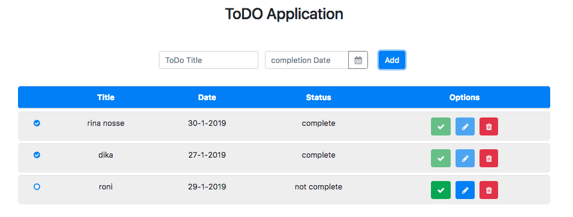

# Kemampuan Akhir Yang Direncanakan

- Peserta mampu mengdisable button edit

# Percobaan mengdisable button edit

- buka file **app.component.html** tambahkan code berikut

```
 <button
            class="btn btn-primary"
            (click)="open(content, todo)"
            [disabled]="todo.complete"
          >
            <i class="fa fa-pencil"></i>
          </button>

```

- jika berhasil maka hasilnya seperti berikut **pada saat status notcompleted maka button edit tdk disabled, tetapi jika statusnya berubah menjadi compete maka button edit akan disable**
